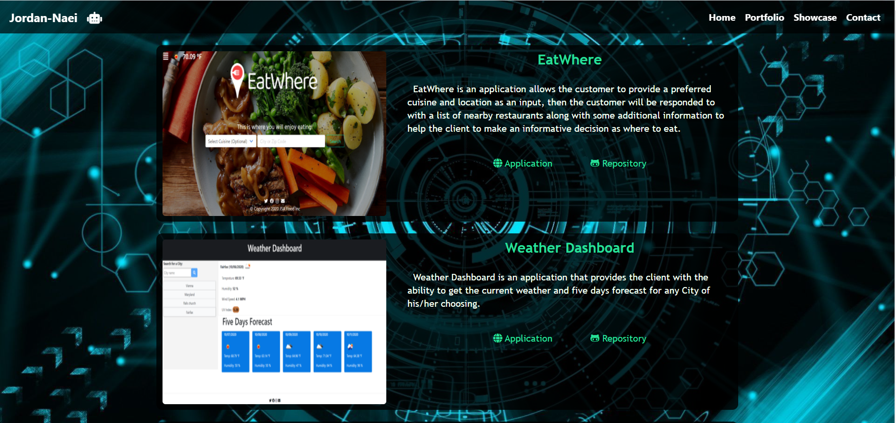
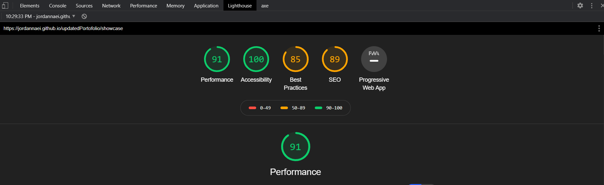

# Updated Portofolio

This project aimed to enhace our portofolio page by adding some extra functionalities to showcase our coding work so far. We added a Showcase page to our website that can be accessed using the navbar. Further, we liked github profile, resume within the footer icons, also added titles to the phone and email icons to list the required information.

## Updated Portfolio Summary

The updated portfolio contain the following within the Showcase Page:

1. My full name. (pass)
2. Links to your GitHub profile & LinkedIn page via footer icons. (pass)
3. A link to my PDF resume via footer icons. (pass)
4. A list of 3-5 projects. For each project, we ensure for each project to include the following:
   - Project title (pass)
   - Link to the deployed version (pass)
   - Link to the GitHub repository (pass)
   - Screenshot of the deployed application (pass)
5. Ensure that your portfolio is free of grammar and spelling mistakes (pass)
6. Including the 2 main projects; eatWhere and passiveIncome, we delivered so far within the showcase page of our portfolio website.

## We leveraged the following technology and resources in our implementation:

- Bootstrap framework: especially within the creation of the Navbar and footer .
- Bootstrap grid system, to ensure that the layout is standarized and responsive to variety of screen sizes.
- Ensured that the website meets the general standards of:
  1- Accessibility.
  2- Performance.
  3- HTML best practices.
  5- SEO.
  Please refer to the word document attached for the Inspect generated report.
- Used W3C Markup Validation Service to ensure html best practices are applied.
- Used Media Queries to takecare of the display in case of shrinking and expanding the browser window to different unstanderized widths.

#### Design

We ensured that our new Showcase page adhere to the following standartds:

- Mobile-first design (pass)
- Choose a color palette for your site so it doesn't just look like
  the default bootstrap theme or an unstyled HTML site. (pass)
- Make sure the font size is large enough to read, and that the colors don't cause eye strain. (pass)

## Updated GitHub Profile

updated the profile accoding to the client requirements https://github.com/JordanNaei

### Updated Resume

updated and linked via the footer icon (Listed under images).

####
Deployed application URL: https://jordannaei.github.io/updatedPortofolio/showcase

####
Mobile Friendly checker:

####
DevTool Test:

####
License: ISO